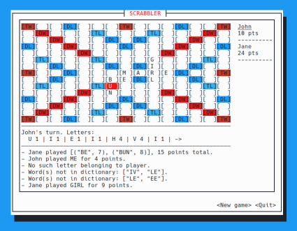

# Scrabble game with simple TUI written in Rust.

  

## Goal
Implementation of The World's Fastest Scrabble Program (1988) by Appel and Jacobson
using the GADDAG-structure as introduced by Gordon in A Faster Scrabble Move Generation
Algorithm (1994).

## Status
Skeleton game complete but algorithm in progress.
Currently doing refactoring to create an elegant solution for transposition of the board.

If you want to check it out, assuming you have cargo installed, 
you can simply run the game with `cargo run`, and the rest is explained in-app.
The program is currently building the Gaddag if it can't be found at the path specified in the toml 
at the moment, so the first time will take a little while.

Will definitively want to store the gaddag in the actual binary using include_bytes!, 
but there are more pressing matters...
